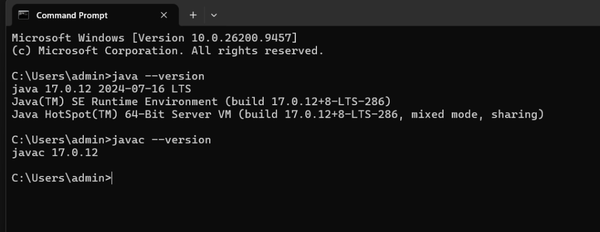
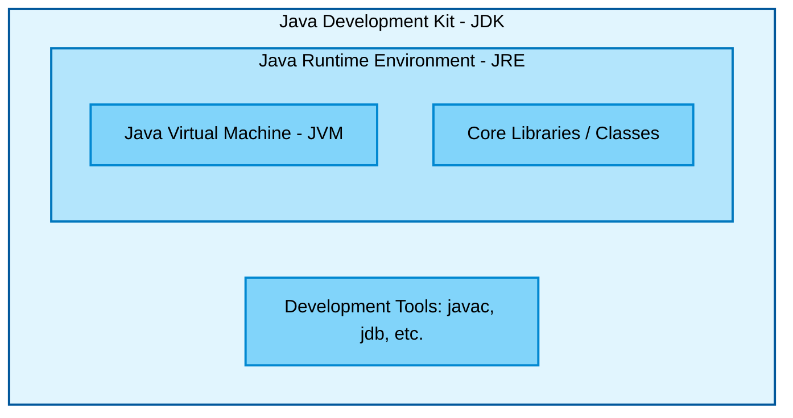
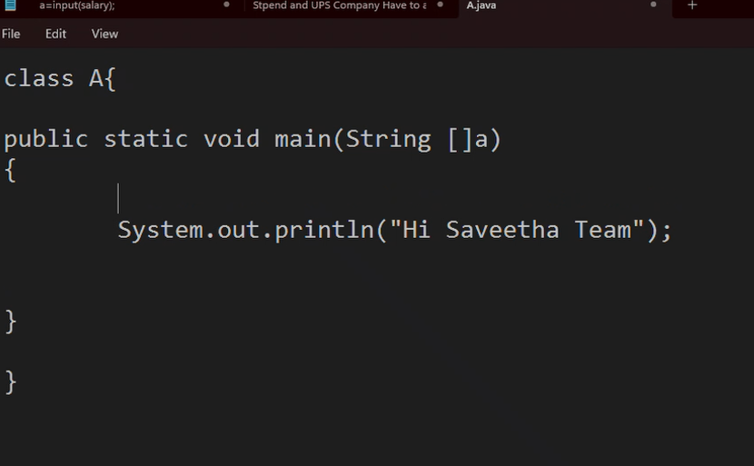

# 📅 Day 1: Java Basics & First Code

Since our initial first day was cut short by a power cut and we only had an introduction, today we officially kicked off the coding part of the training!

---

## 🛠️ Environment Setup Proof
Before writing any code, we verified our Java environment installation. Here is the proof of the successful setup:

```text
C:\Users\admin>java --version
java 17.0.12 2024-07-16 LTS
Java(TM) SE Runtime Environment (build 17.0.12+8-LTS-286)
Java HotSpot(TM) 64-Bit Server VM (build 17.0.12+8-LTS-286, mixed mode, sharing)

C:\Users\admin>javac --version
javac 17.0.12
```



---

## 🧠 Core Concepts Learned

### 1. JDK, JRE, and JVM
We started by understanding the fundamental architecture of Java and how the environment is structured. Here is a visual map of how they relate to each other:



### 2. Data Types
We learned about the different types of data we can store in Java:
* **Primitive Data Types:** `byte`, `short`, `int`, `long`, `float`, `double`, `boolean`, `char`
* **Non-Primitive Data Types:** `String`, Arrays, Classes, etc.

---

## 💻 Coding Outputs

### First Ever Code Written!
This was our very first program to get our hands dirty with Java.



### Positive/Negative Number Check
We were then given a task to write and execute a program that checks whether a given number is positive or not using a ternary operator.

**The Code We Wrote:**
```java
class A {
    public static void main(String[] a) {
        int number = -10;
        System.out.println(number > 0 ? number + " is positive" : number + " is not positive");
    }
}
```

**The Output:**


---

## ⏭️ What's Next? (Tomorrow)
For tomorrow's class, we are gearing up to learn:
1. **Decision Making** (if-else, switch cases)
2. **Looping** (for, while, do-while loops)
3. **Methods**
