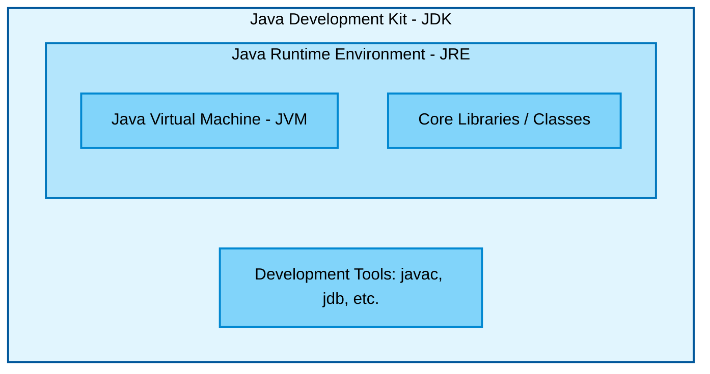
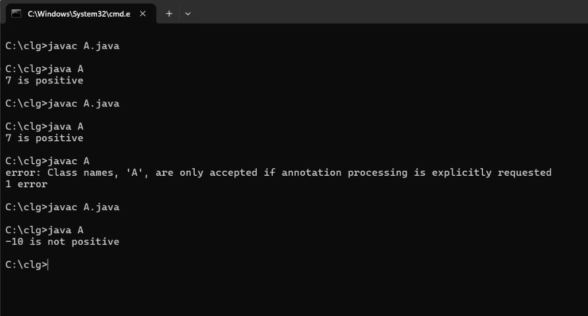
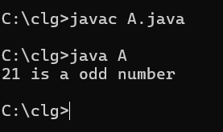

# 📅 Day 2: Java Basics & Core Concepts

Since Day 1 was mostly an introduction, today we officially kicked off the coding part of the training!

---

## 🛠️ Environment Setup Proof
Before writing any code, we verified our Java environment installation. Here is the proof of the successful setup:

```text
C:\Users\admin>java --version
java 17.0.12 2024-07-16 LTS
Java(TM) SE Runtime Environment (build 17.0.12+8-LTS-286)
Java HotSpot(TM) 64-Bit Server VM (build 17.0.12+8-LTS-286, mixed mode, sharing)

C:\Users\admin>javac --version
javac 17.0.12
```


---

## 🧠 Core Concepts Learned

### 1. JDK, JRE, and JVM
We started by understanding the fundamental architecture of Java and how the environment is structured. Here is a visual map of how they relate to each other:



### 2. Data Types
We learned about the different types of data we can store in Java:
* **Primitive Data Types:** `byte`, `short`, `int`, `long`, `float`, `double`, `boolean`, `char`
* **Non-Primitive Data Types:** `String`, Arrays, Classes, etc.

### 3. Control Flow & Loops
Today, we covered a lot of foundational ground in Java! We learned:
* **Conditionals:** `if`, `else if`, `else`, and **nested if** statements.
* **Switch Case:** Using switch statements to simplify multiple conditions.
* **Loops:** Exploring `while` loops and `for` loops to repeat operations.
* **Input Taking:** Using `Scanner` to read dynamic input from the user.

---

## 💻 Coding Exercises & Outputs

### 1. First Ever Code Written!
This was our very first program to get our hands dirty with Java.


### 2. Positive/Negative Number Check
Using the ternary operator to check for positive/negative numbers.


### 3. Odd / Even Check (if-else)
Checking if a number is odd or even using the modulo operator.


### 4. Login Validation (Nested If)
A mock login system using nested if conditions to validate username and password sequentially.


### 5. Multiplication Table (Scanner & For Loop)
Taking start and end ranges as input and printing a multiplication table using a for loop.


---

## 📝 Homework
Homework was given to practice these new concepts:
1. Sum of numbers
2. Factorial
3. Number of digits

*(The files for these are already present in this folder!)*
