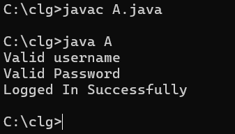
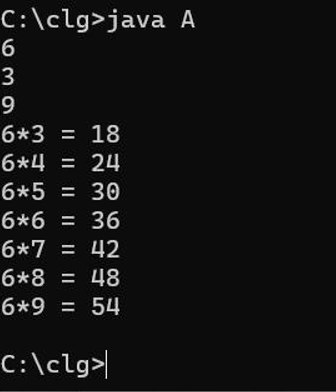

# 📅 Day 3: Control Flow, Loops, and Input

Today, we covered a lot of foundational ground in Java regarding decision-making and repeating actions!

---

## 🧠 Core Concepts Learned

* **Conditionals:** `if`, `else if`, `else`, and **nested if** statements.
* **Switch Case:** Using switch statements to simplify multiple conditions.
* **Loops:** Exploring `while` loops and `for` loops to repeat operations.
* **Input Taking:** Using `Scanner` to read dynamic input from the user.

---

## 💻 Coding Exercises & Outputs

### 1. Odd / Even Check (if-else)
Checking if a number is odd or even using the modulo operator.

### 2. Login Validation (Nested If)
A mock login system using nested if conditions to validate username and password sequentially.

### 3. Multiplication Table (Scanner & For Loop)
Taking start and end ranges as input and printing a multiplication table using a for loop.

### 4. Switch Case Example
We practiced `switch` statements to check parity of numbers.

### 5. Movie Ticket Booking System
We built a mini system for movie ticket booking with nested conditions and inputs.

### 6. While Loop Countdown
A simple countdown timer implemented using a while loop.

*(Source code for all of these is available in the `Day_3` directory!)*

---

## 📝 Homework
Homework was given to practice these new concepts. The solutions have been saved in the `Homework/` folder!
1. **Sum of numbers** (`Sum.java`)
2. **Factorial** (`Factorial.java`)
3. **Number of digits** (`Digits.java`)
